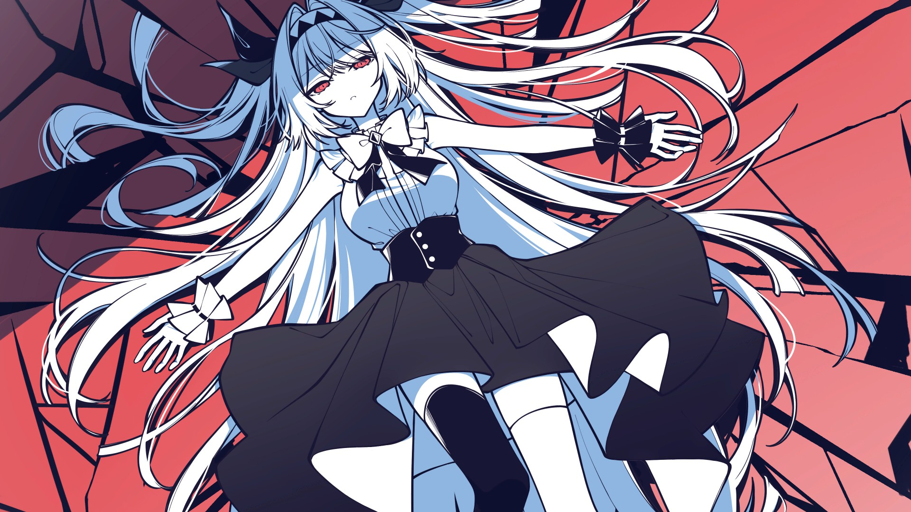
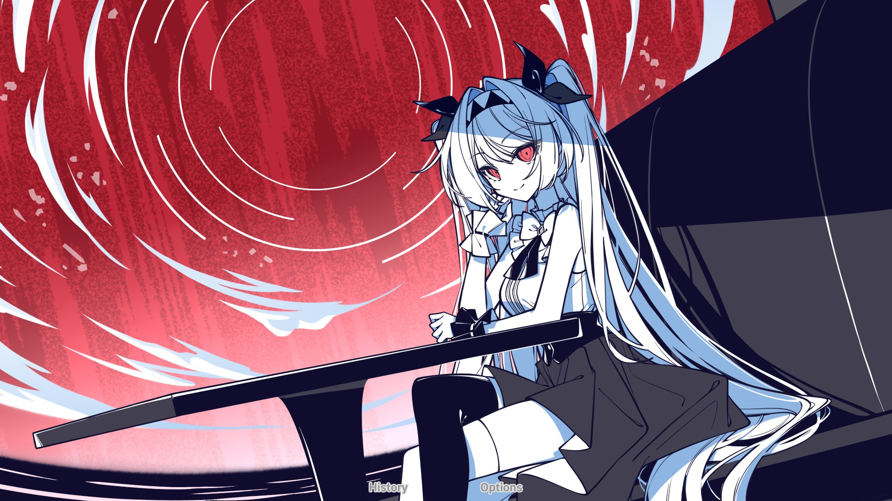
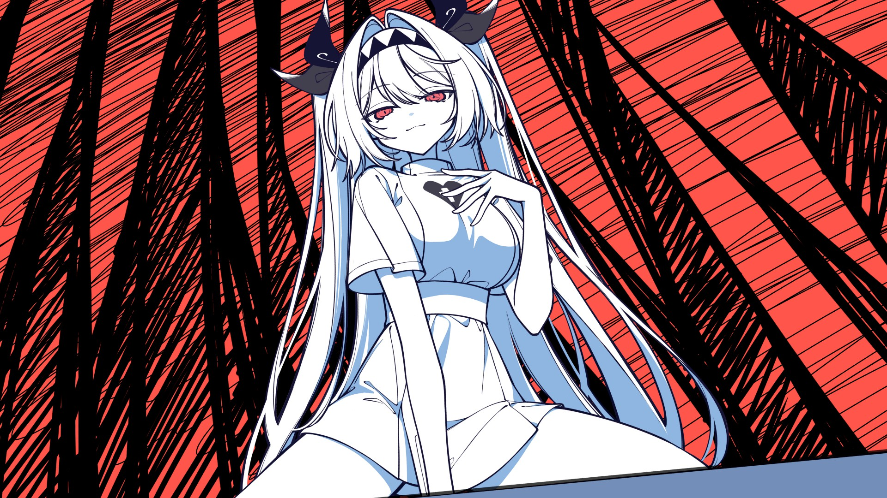
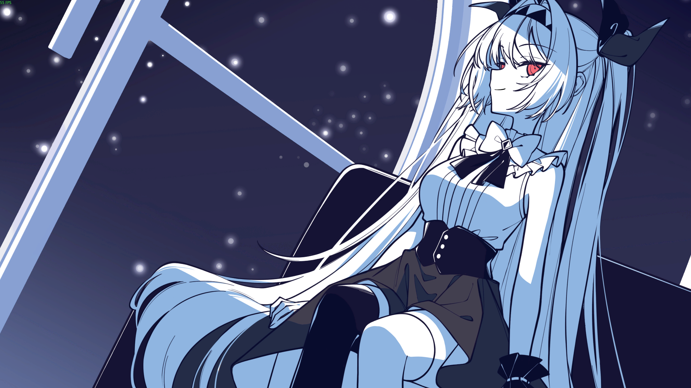
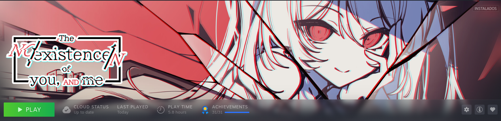

É difícil descrever esse jogo em poucas palavras, principalmente os sentimentos mistos que ele me traz.

É um jogo curto, pra ser zerado em uma tarde só, principalmente se você tiver tempo livre (ou estiver procrastinando como eu).

O foco do jogo é falar sobre existencialismo, pricipalmente no conceito de existência.

Primeira coisa diferente que faço aqui no blog, de vez em nunca vou soltar uma analise ou outra de um joguinho aqui, nada muito elaborado, apenas pra lembrar depois de muito tempo sem jogar.

## O jogo

### Gameplay

Visual Novel, não tem nem o que comentar sobre isso, clica na tela e passa o diálogo.

### Gráficos

Simplesmente *FANTÁSTICO* o quão lindo o jogo é. Ficaria horas olhando pra ele. 
A lilith tem um design maravilhoso, juntamente com os menus e os backgrounds que tem uma estética incrível.

### História

A principal parte do jogo, sinto que tudo nela foi muito bem pensado, desde o início até cada um dos 3 finais.

Os diálogos são interessantes e facilmente me mantiveram preso na premissa do jogo e prestando atenção em cada acontecimento. Nada que acontece na história é por acaso ou sem sentido, tudo tem um propósito dentro da narrativa (uma coisa que me deixa bem feliz em jogos focados em história).

### Trilha Sonora

Não tenho outra palavra pra descrever se não **maravilhosa**.

São poucas músicas, mas elas ficam muito bem marcadas na mente, como o jogo é curto, nem dá tempo de ver elas se repetindo.

## Críticas

Agora é uma parte meio complicada, o jogo é muito bom, isso é inquestionável, mas minha experiência pessoal com ele teve altos e baixos.

Não sou muito de jogar jogos com escolhas e finais diferentes, principalmente que você precisa rejogar o jogo INTEIRO pra ter o final (atrasei bastante OMORI por isso), então, esse foi o primeiro jogo desse tipo que rejoguei inteiro (e inclusive platinei). Não acho que seja um problema, mas rejogar um capitulo inteiro e fechar pra prosseguir a história com uma conquista é meio chato (fiz isso depois de fazer o primeiro final).

Ainda falando sobre o final, esperava algo bastante impactante, (especialmente depois do capítulo 3), mas simplesmente minhas expectativas não foram muito bem atendidas, os finais são algo bem mais simples do que parecem. Não é algo ruim, mas acredito que tive expectativas maiores do que deveria ter dos finais.

Pra proposta de tratar tanto de existencialismo esse jogo é *muito* raso, várias vezes sentia que faltava alguma coisa pra completar uma cena (ou o jogo dava um salto gigantesco na história pra logo depois entregar um capítulo meio (????). Não acho que quem não tem tanta familiaridade com filosofia vai ter a mesma opinião que eu, mas como um entusiasta do assunto, acho que esperava um pouco mais.

## Considerações finais

O jogo com certeza vale muito muito muito a pena, principalmente se for pra ter uma gameplay cega.

Não me deu um hype absurdo nem uma mudança drástica de visão de mundo, mas me fez sentir apego a lilith e emoções boas e ruins jogando.

O jogo é um 7/10 (beirando o 6/10) de experiência própria, mas dou total razão pra quem acha que o jogo é um 8 ou superior.

Com certeza vou continuar ouvindo as músicas do jogo e vez ou outra lembrar dele.

Algumas polêmicas quanto a equipe de produção também me deixaram bem triste com o caminho que a continuação do jogo levou, sendo um JRPG sem a maioria da equipe original do primeiro game. Perdi bastante o hype pra continuar acompanhando a franquia.

E sim, eu acho que ela existe.

