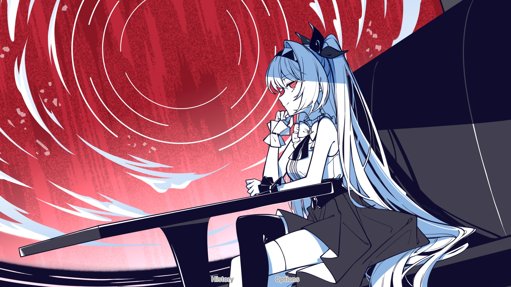

acredito que já deu pra perceber pelo post passado (a analise de NONAND), mas eu fiz a possibilidade de fazer um banner pro post.

basicamente foi só isso que tivemos por hora. Penso em faer um tipo de postagem com subpáginas, mas isso eu acredito que fica pra depois, por hora vamos ter apenas isso de modificação.

esse daqui é só o teste pro banner também, pra mostrar qual que é a deles. (queria botar mais uma imagem da lilith, mas pensei que seria estranho dms ter 2 banners dela um em seguida do outro, então, olá hatsune miku)

